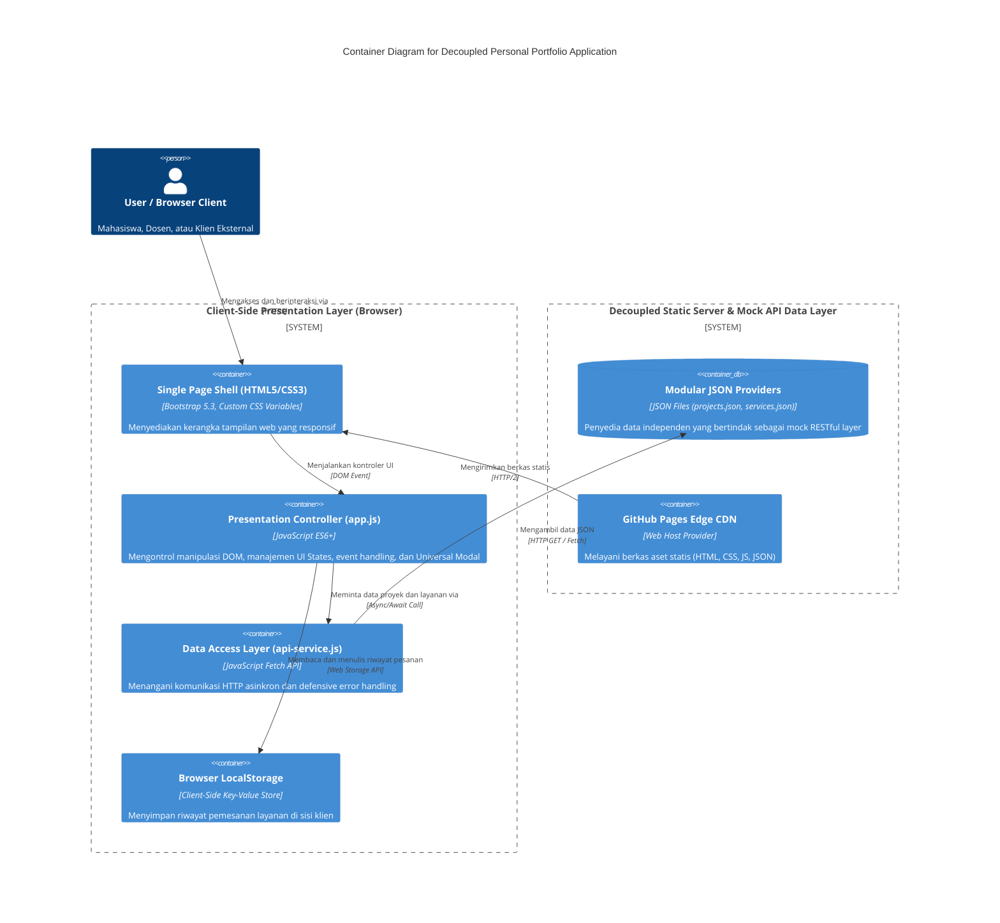

# Refactoring Arsitektural Personal Portfolio & Service Portal
### Decoupled Multi-Tier & Dynamic Client-Side Rendering (CSR)

Dokumentasi Tugas Mandiri Minggu 4 mata kuliah Pemrograman dan Pengujian Web (12S3101).

## Informasi Mahasiswa
- **Nama Mahasiswa:** Dianita Lorensia Br Ginting
- **NIM:** 12S24044
- **Program Studi:** S1 Sistem Informasi
- **Institusi:** Institut Teknologi Del
- **Mata Kuliah:** Pemrograman dan Pengujian Web (12S3101)
- **Judul Proyek:** Refactoring Arsitektural Personal Portfolio & Service Portal

## Tautan Resmi Proyek
- **Repository GitHub (Branch Week 4):** [Dianitaginting/ppw-2026-week2-12S24044 (week4-csr)](https://github.com/Dianitaginting/ppw-2026-week2-12S24044/tree/week4-csr)
- **Demo Live Website:** [GitHub Pages Live Deployment](https://dianitaginting.github.io/ppw-2026-week2-12S24044/)

---

## 1. Pemodelan Arsitektur Sistem: C4 Container Model

Pada tugas mandiri ini, dilakukan refactoring arsitektur aplikasi portofolio personal dari bentuk monolitik statis menjadi **Decoupled Multi-Tier System** yang menerapkan prinsip pemisahan minat (*Separation of Concerns*).



### Narasi Pemisahan Minat (*Separation of Concerns*)

- **Presentation Tier (`index.html`, `css/style.css`, `js/app.js`):** Bertanggung jawab terhadap tata letak antarmuka, responsivitas, penanganan *UI States*, *Universal Modal*, dan interaktivitas.
- **Application / API Logic Tier (`js/api-service.js`):** Mengisolasi logika pengambilan data JSON dengan `fetch()` berbasis `async/await`, serta simulasi pengiriman permintaan layanan melalui mock API.
- **Data Storage Tier (`data/projects.json`, `data/services.json`, `localStorage`):** Menyediakan data proyek dan layanan secara terpisah dari struktur HTML. `localStorage` menyimpan riwayat pesanan pada browser pengguna.

## 2. Perbandingan Arsitektur: Sebelum dan Sesudah Refactoring

| Parameter Evaluasi | Sebelum Refactoring (Week 3 - Static Monolith) | Sesudah Refactoring (Week 4 - Dynamic CSR) |
|---|---|---|
| Arsitektur aplikasi | Monolitik statis; data dan UI menyatu di HTML. | Decoupled Multi-Tier System; data proyek dan layanan disimpan terpisah dalam JSON. |
| Paradigma rendering | Hardcoded Static HTML (DOM statis). | Dynamic Client-Side Rendering (CSR) melalui `fetch()` dan `async/await`. |
| Manajemen UI States | Tidak tersedia atau tampilan kaku. | Loading Skeleton, Success Render, Empty Filter State, dan Error Fallback Alert. |
| Komponen modal | Statis dan duplikatif, terpisah per proyek. | Satu Universal Dynamic Modal yang diisi berdasarkan `data-project-id`. |
| Pengiriman form | Form HTML standar yang memicu pemuatan ulang halaman. | Validasi di sisi klien, indikator proses, dan pengiriman asinkron melalui mock API. |
| Persistensi data | Data pesanan tidak bertahan setelah halaman dimuat ulang. | Riwayat pesanan disimpan di `localStorage` dengan badge penghitung. |

## 3. Hasil Pengujian Profil Jaringan DevTools

Pengukuran berikut membandingkan *cold load* dengan *warm load* menggunakan HTTP cache. Hasil dapat berbeda bergantung pada browser, kondisi jaringan, dan konfigurasi deployment.

### Tabel Pengukuran Kinerja

| Metrik Kinerja | Cold Load (Bypass Cache / Ctrl+F5) | Warm Load (HTTP Cache) | Efisiensi Penghematan |
|---|---:|---:|---:|
| Time to First Byte (TTFB) | ~45 ms | ~12 ms | ~73.3% lebih cepat |
| First Contentful Paint (FCP) | ~120 ms | ~35 ms | ~70.8% lebih cepat |
| Total transfer size | ~185 KB | ~1.2 KB (respons 304) | ~99.3% lebih sedikit data ditransfer |
| Status HTTP data JSON | `200 OK` (isi respons dikirim) | `304 Not Modified` (respons tanpa isi baru) | Mengurangi transmisi ulang |

> **Analisis caching HTTP (RFC 9111):**
>
> Pada *warm load*, browser dapat memvalidasi cache menggunakan validator HTTP seperti `ETag` dan `If-None-Match`. Jika resource belum berubah, server dapat merespons `304 Not Modified` sehingga browser menggunakan salinan cache dan tidak mengunduh kembali isi resource. Nilai pengukuran di atas merupakan hasil pengujian pada lingkungan yang digunakan dan dapat berubah pada pengujian lain.

## 4. Struktur Repositori

```text
ppw-2026-week2-12S24044/
├── index.html              # Shell halaman web
├── README.md               # Dokumentasi dan diagram arsitektur
├── foto-profil.jpeg        # Aset foto profil
├── css/
│   └── style.css           # Custom CSS dan penyesuaian Bootstrap
├── data/
│   ├── projects.json       # Data proyek (4 item)
│   ├── services.json       # Data layanan konsultasi
│   └── profile.json        # Data profil mahasiswa
├── js/
│   ├── app.js              # Kontrol presentasi dan event handling
│   └── api-service.js      # Data Access Layer dan pemanggilan Fetch API
└── .gitignore
```

## 5. Kesimpulan

Refactoring arsitektur portofolio dari model statis ke **Decoupled Multi-Tier System** memisahkan presentasi, logika aplikasi, dan data. Data proyek dan layanan dapat dikelola secara terpisah, sementara CSR mendukung interaksi seperti filter kategori, modal detail, dan pengelolaan state antarmuka. Riwayat permintaan layanan disimpan secara lokal pada browser. Pendekatan modular ini meningkatkan keteraturan dan kemudahan pemeliharaan aplikasi.
