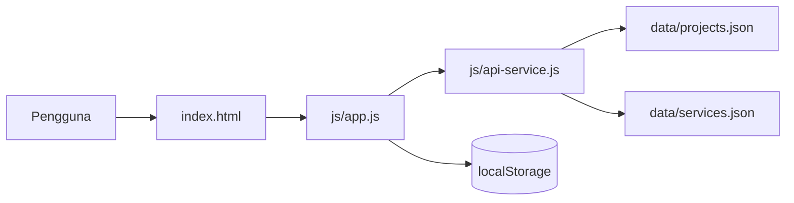

# Personal Portfolio & Service Portal

## Informasi Umum
- Nama Mahasiswa: Dianita Lorensia Br Ginting
- NIM: 12S24044
- Program Studi: S1 Sistem Informasi
- Institusi: Institut Teknologi Del
- Mata Kuliah: Pemrograman dan Pengujian Web
- Judul Proyek: Personal Portfolio & Service Portal

## Link Proyek
- Repository GitHub: [Dianitaginting/ppw-2026-week2-12S24044](https://github.com/Dianitaginting/ppw-2026-week2-12S24044)
- Demo Live: [GitHub Pages](https://dianitaginting.github.io/ppw-2026-week2-12S24044/)

## Latar Belakang
Pada tugas mandiri ini, dilakukan refactoring arsitektur aplikasi portofolio personal dari bentuk monolitik statis menjadi struktur yang lebih modular dan interaktif. Awalnya, data dan tampilan digabung dalam satu halaman web yang bersifat statis. Kondisi ini menyebabkan pengelolaan data kurang fleksibel, pengembangan UI menjadi kurang efisien, dan performa serta maintainability proyek tidak optimal.

Untuk mengatasi permasalahan tersebut, diterapkan pendekatan Decoupled Multi-Tier Architecture dan Dynamic Client-Side Rendering (CSR). Aplikasi dibangun dengan memisahkan layer presentasi, logika aplikasi, dan data. Data proyek serta layanan disimpan dalam format JSON yang diambil secara dinamis melalui JavaScript, sehingga halaman dapat dirender secara lebih modular, responsif, dan mudah diperbarui.

## Tujuan
- Mengembangkan portofolio personal yang lebih modern dan profesional.
- Menerapkan prinsip separation of concerns pada struktur aplikasi.
- Merepresentasikan data proyek dan layanan secara terpisah dari file HTML utama.
- Meningkatkan pengalaman pengguna melalui dinamika UI, filter kategori, modal detail, serta validasi form.
- Menunjukkan pemahaman mahasiswa terhadap arsitektur web modern dan pengembangan front-end berbasis data.

## Ruang Lingkup
Proyek ini mencakup beberapa aspek utama, yaitu:
- desain antarmuka profil mahasiswa dan portal layanan,
- pemisahan data ke dalam file JSON,
- implementasi fetch API untuk pengambilan data,
- integrasi filter proyek berbasis kategori,
- penerapan rendering dinamis di sisi klien,
- validasi form konsultasi layanan,
- penyimpanan riwayat pemesanan pada browser menggunakan `localStorage`.

## Metode Implementasi
Sistem ini dibangun dengan pendekatan front-end berbasis web yang terdiri dari beberapa layer, yaitu:

1. Presentation Layer
   - berisi struktur HTML utama dan layout tata letak halaman,
   - diimplementasikan pada `index.html` dan styling pada `css`.

2. Application Logic Layer
   - berisi logika rendering, filter, modal, serta event handling,
   - diimplementasikan pada `js/app.js`.

3. Data Access Layer
   - berisi fungsi pengambilan data JSON dan simulasi submit layanan,
   - diimplementasikan pada `js/api-service.js`.

4. Data Layer
   - terdiri dari `data/projects.json`, `data/services.json`, dan `localStorage` sebagai penyimpanan lokal.

## Arsitektur Aplikasi


## Fitur Utama
- Portofolio responsif dengan layout modern dan rapi.
- Filter kategori proyek secara dinamis.
- Modal detail proyek yang dapat diisi secara universal.
- Kondisi UI yang terstruktur, seperti loading state, empty state, dan error state.
- Form konsultasi layanan dengan validasi sisi klien.
- Penyimpanan histori pemesanan di browser melalui `localStorage`.
- Penggunaan data terstruktur dalam format JSON untuk mempermudah update konten.

## Perbandingan Arsitektur
| Aspek | Sebelum Refactoring | Sesudah Refactoring |
|---|---|---|
| Struktur aplikasi | Monolitik dan statis | Decoupled multi-tier |
| Data | Berdampingan dengan HTML | Dipisah dalam JSON |
| Rendering | Hardcoded DOM | Dynamic CSR dengan `fetch()` |
| UI state | Tidak tersedia | Loading, empty, success, error |
| Modal | Statik dan duplikatif | Universal modal dinamis |
| Form submit | Reload halaman | Asynchronous submit |
| Persistensi | Tidak konsisten | Disimpan di `localStorage` |

## Teknologi yang Digunakan
- HTML5
- CSS3
- Bootstrap 5
- JavaScript ES6+
- Fetch API
- Local Storage API
- JSON

## Struktur Repository
```text
ppw-2026-week2-12S24044/
├── index.html
├── README.md
├── foto-profil.jpeg
├── css/
│   └── style.css
├── data/
│   ├── projects.json
│   ├── services.json
│   └── profile.json
├── js/
│   ├── app.js
│   └── api-service.js
└── .gitignore
```

## Hasil dan Manfaat
Proyek ini berhasil menghasilkan portofolio digital yang lebih modern, terstruktur, dan mudah dikelola. Selain itu, aplikasi ini juga menunjukkan penerapan konsep arsitektur web yang relevan dengan praktik pengembangan front-end saat ini. Dengan sistem yang terpisah antar layer, proses pengembangan, pemeliharaan, dan pembaruan konten menjadi lebih efisien.

## Kesimpulan
Berdasarkan hasil implementasi, refactoring arsitektur portofolio dari model statis ke model Decoupled Multi-Tier System memberikan peningkatan signifikan dalam hal struktur kode, pengelolaan data, interaktivitas, dan pengalaman pengguna. Implementasi ini juga membuktikan bahwa pendekatan modular dapat meningkatkan maintainability serta fleksibilitas aplikasi web tanpa mengorbankan kualitas tampilan dan fungsionalitas.

## Catatan Akhir
Dokumen ini disusun sebagai bentuk dokumentasi tugas mandiri untuk menunjang pemahaman terhadap proses refactoring arsitektur aplikasi web serta penerapan prinsip desain sistem yang lebih baik dalam pengembangan front-end.
